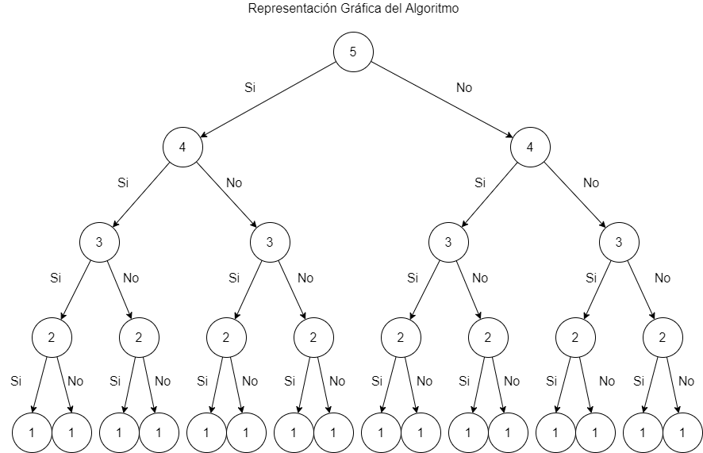

<p align="center" style="font-size:24pt; font-bold:true">Análisis de Algoritmos</p>
<p align="center" style="font-size:20pt; font-bold:true">Proyecto 3</p>
<p align="center" style="font-size:14pt; font-bold:true">Rodrigo Alexander Richards Valenzuela</p>
<p align="center" style="font-size:14pt; font-bold:true">Matrícula: 2016404813</p>
<p align="center" style="font-size:14pt; font-bold:true">Felipe Alejandro Cerda Saavedra</p>
<p align="center" style="font-size:14pt; font-bold:true">Matrícula: 2019060121</p>

<div style="page-break-after: always;"></div>

# Descripción

Este proyecto consiste en aplicar las técnicas de programación dinámica y aproximación para resolver el problema de la mochila 0-1. Este problema es NP-Complete en general, aunque usando programación dinámica se considera pseudo-polinomial.

Considere una mochila 0-1 con capacidad máxima $C$ con $n$ objetos posibles de agregar los cuales son identificados mediante un número $i\in N = \{1, 2, 3, ...,  n\}$. Además, cada objeto tiene un peso $p_{i}$ y un valor $v_{i}$. El problema de la mochila consiste en elegir el subconjunto de los $n$ objetos que maximiza el valor acumulado o ganancia de los objetos cuyo peso acumulado no supera la capacidad $C$ de la mochila, tal como se expresa a continuación:

$M(C) = max \Sigma_{i \in N}x_{i}v_{i}$
tal que  $\Sigma_{i \in N}x_{i}v_{i} \leq C$
$x_{i} \in {0, 1} \forall i \in N$

Asuma que $v_{i} \in N$ y $p_{i} \in N$

**a) Describa y proporcione una solución usando programación dinámica y establezca su complejidad asintótica del tiempo de ejecución.**

Resolveremos el problema siguiendo esta estrategia

1. Proporcionaremos una solución recursiva
2. Mejoramos lo anterior memorizando algunos de los resultados intermedios   

Consideremos el siguiente algoritmo:
```kotlin
// n numero de items a considerar
// C capacidad de la mochila
// p[] arreglo con los pesos
// v[] arreglo con los valores
fun KS(n, C)
    if (n == 0 || c == 0)
        result = 0
    else if (p[n] > C)
        result = KS(n-1, C)
    else
        tmp1 = KS(n-1, C)
        tmp2 = v[n] + KS(n-1, C - p[n])
        result = max(tmp1, tmp2)
    return result
```

Es sencillo notar que este algoritmo resuelve el problema de la mochila. Sin embargo, es muy ineficiente. A continuación veremos por qué:

Para una mochila de Capacidad $C = 10$ y considerando la siguiente tabla con pesos y valores. 


|Item| It1 | It2 | It3 | It4 | It5 |
|--|--|--|--|--|--|
| Peso | 1 | 2 | 3 | 2 | 5 |
| Valor | 5 | 1 | 3 | 4 | 2 |

Partiendo desde 5, analicemos el árbol de decisiones que representa el algoritmo. Este árbol se genera por las llamadas recursivas:

```kotlin
tmp1 = KS(n-1, C) // No se incluye item n en la mochila
tmp2 = v[n] + KS(n-1, C - p[n]) // Si se incluye item n en la mochila
```



Como vemos, la complejidad de este algoritmo es $O(2^n)$. 

Ahora modificaremos el algoritmo para hacerlo más eficiente mediante memorización.

```kotlin
// n numero de items a considerar
// C capacidad de la mochila
// p[] arreglo con los pesos
// v[] arreglo con los valores
// mem[n][C] arreglo donde guardamos los resultados parciales

// inicializamos el arreglo mem[n][C] con null para cada elemento
fun KS(n, C)
    if (mem[n][C] != null)
        return mem[n][C]
    if (n == 0 || c == 0)
        result = 0
    else if (p[n] > C)
        result = KS(n-1, C)
    else
        tmp1 = KS(n-1, C)
        tmp2 = v[n] + KS(n-1, C - p[n])
        result = max(tmp1, tmp2)
    mem[n][C] = result // El máximo número de veces que tenemos que hacer esta operación es (n*C)
    return result
```
En este caso calcularemos el valor de cada rama una sola vez y  en caso de requerir alguno de esos valores de nuevo, obtendremos su valor desde memoria. Con esto logramos que el algoritmo se ejecute en $O(n*C)$. Esto es mucho mejor que el resultado anterior.

**b) ¿Qué puede decir respecto al tiempo de ejecución? Observa alguna diferencia a la forma en la cual hemos analizado el tiempo de ejecución en unidades anteriores? Establezca de que manera la complejidad obtenida para el problema puede incidir en la complejidad en términos de tiempo de ejecución. La complejidad asociada a la solución obtenida normalmente se conoce como pseudo polinomial. Investigue y comente por qué la solución para la mochila 0-1 se dice que es pseudo polinomial.** 

En el ejemplo anterior utilizamos un arreglo para guardar resultados intermedios y luego concluimos que el tiempo de ejecución es $O(n*C)$. Esto parece ser linear, sin embargo podemos encontrar casos en que esto no se cumple. Supongamos que $C = n!$, en este caso la complejidad de nuestro algoritmo es peor que cuando lo hicimos por fuerza bruta. De esta forma la complejidad del problema puede afectar la complejidad en términos de tiempo de ejecución, haciendo peor una solución que era teóricamente mejor. 

Un algoritmo cuya complejidad temporal de peor caso depende del valor numérico de la entrada (¡no el numero de elementos de la entrada!) es llamado pseudopolinomial. Claramente este es el caso de la mochila 0-1. Supongamos que la capacidad de la mochila es $C = 2^n$, esto es peor que la primera solución.

**c) Implemente el algoritmo usando el enfoque bottom-up mediante tabulación.**

```cpp
/*
    Input    
    values: valores de los objetos
    weights: peso de los objetos
    C: capacidad en peso de la mochila
    x: arreglo binario vacío que representa los objetos dentro de la mochila
    Output: 
    valor total de los objetos dentro de la mochila
    x: arreglo binario con los objetos dentro de la mochila al finalizar el algortimo
*/
void knapsack(vector<int> &values, vector<int> &weights, int C, vector<int> &x){
    vector<int> aux(C+1);
    vector<vector<int> > memo(values.size()+1,aux);
    for(int elementosTotales = 0; elementosTotales <= values.size(); elementosTotales++){
        for(int capacidad = 0; capacidad <= C; capacidad++){
            int elementoAct = elementosTotales - 1;     //Elemento actual
            if (elementosTotales == 0 || capacidad == 0) {
            memo[elementosTotales][capacidad] = 0;
            } 
            else if (weights[elementoAct] > capacidad) {
                memo[elementosTotales][capacidad] = memo[elementosTotales - 1][capacidad];
            } 
            else {
                int seleccionar = values[elementoAct] + memo[elementosTotales - 1][capacidad - weights[elementoAct]];
                int noSeleccionar = memo[elementosTotales - 1][capacidad];
                memo[elementosTotales][capacidad] = max(seleccionar, noSeleccionar);
            }
        }
    }
    int res = memo[values.size()][C];     
    printf("%d ", res); 
      
    int c = C; 
    for(int i = values.size(); i > 0 && res > 0; i--) {
        if (res == memo[i - 1][c])  
            continue;         
        else {
            x[i-1] = 1;
            res = res - values[i - 1]; 
            c = c - weights[i - 1]; 
        } 
    }
}
```

**d) Ahora, resuelva el problema de programación dinámica usando tabulación, pero esta vez en lugar de usar el peso en las columnas use los valores de los objetos. Describa la solución usando programación dinámica para este enfoque de solución.**

Existen 2 atributos clave para que podamos aplicar programación dinámica a un problema. La existencia de una **subestructura óptima** y de **problemas superpuestos**.

Consideremos una mochila de capacidad $C$ y los siguiente items:

|Item| It1 | It2 | It3 | It4 | It5 | It6 | It7 |
|--|--|--|--|--|--|--|--|
| Peso | 3 | 2 | 4 | 5 | 6 | 2 | 1 |
| Valor | 2 | 3 | 5 | 4 | 3 | 5 | 2 |

Para entender el algoritmo debemos precisar cuál es el problema que en realidad resolvemos utilizando la siguiente tabla.

|   |     | V | A | L | O | R | E | S |     |    |
|---|-----|---|---|---|---|---|---|---|-----|----|
|   |     | **1** | **2** | **3** | **4** | **5** | **6** | **7** | **...** | **24** |
| **I** | **1**   | - | 3 | - | - | - | - | - | ... | ... |
| **T** | **2**   | - | 3 | 2 | - | 5 | - |   | ... | ... |
| **E** | **3**   | - | 3 | 2 | - | 4 | - | 7 | ... | ... |
| **M** | **4**   | - | 3 | 2 | 5 | 4 | 8 | 7 | ... | ... |
| **S** | **...**  | ... | ... | ... | ... | ... | ... | ... | ... | ... |

Las columnas representan valores en el intervalo $[1, V]$ con $V = \sum_{i=1}^{7} v_i$, por su parte, las filas representan a los items.
Cada columna servirá de valor objetivo de manera que en cada celda almacenamos un peso si y solo si alcanzamos dicho valor, ya sea insertando sólo ítem actual o una selección de items, privilegiando aquella alternativa de menor peso. 

Si miramos la celda $(f, c) = (1,2)$ veremos el número **3** que corresponde al **peso del item 1**. Notemos que para su fila ninguna otra celda está llena. Esto es evidente, pues estamos considerando un único elemento.

Considerando la celda $(f, c) = (2,2)$ nos enfrentamos al problema de buscar una combinación de ítems óptima de valor 2 por segunda vez. Al contrario que la primera vez, lo único que debemos hacer es rescatar el valor de la fila anterior. Nos hemos encontrado con un **problema superpuesto y hemos almacenado su valor para reducir la complejidad del problema**.

Siguiendo la misma lógica pongamos atención a la celda $(f, c) = (4,6)$. Si insertamos el **ítem 4** nos harán falta **2 unidades de valor** **¿Cuál es la combinación de objetos óptima para el valor 2?**. No será necesario recomputar la solución: esta siempre estará almacenada en la fila inmediatamente anterior (en caso de que exista).

Una vez que hemos completado la tabla, podemos buscar la solución óptima para la mochila. Para esto, vamos a la última columna, la de mayor valor, y buscamos un peso $w$ tal que $w <= C$. Si no lo hayamos, retrocedemos una columna y buscamos de nuevo. Repetimos cuantas veces sea necesario. Para conseguir la lista de ítems, iteramos sobre las filas de la tabla. Para ver cuales pertenecen al conjunto solución, miramos la celda actual y la que está inmediatamente arriba, si tienen el mismo valor, el objeto actual no pertenece y debemos repetir el proceso hasta que hayamos alcanzado el valor objetivo. Podemos explicar intuitivamente esto: si una celda tiene el mismo valor que la de arriba quiere decir que es producto de una optimización previa. 

Es necesario notar que este algoritmo realmente minimiza el peso de los objetos tomando como restricción un cierto valor $v$ y una combinación de items. A diferencia del caso anterior, la capacidad de la mochila no es relevante. En este ejemplo nunca hemos proporcionado un valor para $C$ y las conclusiones siguen teniendo validez.

Supongamos que por motivos que escapan a nuestro poder el algoritmo se detiene en el **ítem 4**. Los resultados seguirán siendo válidos para esos cuatro objetos, o en otras palabras, nos encontramos frente una **subestructura óptima**.

**Implementación de la solución**
```cpp
/*
    Input    
    values: valores de los objetos
    weights: peso de los objetos
    C: capacidad en peso de la mochila
    x: arreglo binario vacío que representa los objetos dentro de la mochila
    Output: 
    valor total de los objetos dentro de la mochila
    x: arreglo binario con los objetos dentro de la mochila al finalizar el algortimo
*/
int knapsackV(vector<int> &values, vector<int> &weights, int C, vector<int> &x) {
    int V = 0;
    int n = values.size();
    for (int i = 0; i < n; i++)
        V += values[i];
    vector<int> aux(V+1, 0);
    vector<vector<int> > memo(values.size() + 1, aux);  
    memo[0][0] = C + 1;      
    pair<int, int> max_weight = make_pair(0,0);        
    for (int e = 1; e < n + 1; e++){        
        for (int v = 1; v < V + 1; v++) {
            int opcion1 = MAX;
            int opcion2 = MAX;
            int valorRestante = v - values[e - 1]; //1
            if (memo[e - 1][v] > 0)
                opcion1 = memo[e - 1][v];
            if (valorRestante >= 0) {
                if (valorRestante == 0) 
                    opcion2 = weights[e - 1];
                else if (memo[e - 1][valorRestante] != 0)
                    opcion2 = weights[e - 1] + memo[e - 1][valorRestante];
            }
            int seleccionado = min(opcion1, opcion2);
            if (seleccionado != MAX) {
                memo[e][v] = seleccionado;
                if (seleccionado <= C && max_weight.second <= v) {
                    if (max_weight.second < v || memo[max_weight.first][max_weight.second] > seleccionado) {
                        max_weight.first = e;
                        max_weight.second = v;   
                    }
                }
            }
        }
    }

    int v = max_weight.second;
    for (int e = max_weight.first; e > 0; e--) {
        if (v == 0) 
            break;
        if (memo[e][v] != memo[e - 1][v]) {
            x[e - 1] = 1;
            v = v - values[e - 1];            
        }
    }
    return max_weight.second;
}
```

**e) Considere el mismo algoritmo anterior, pero ahora asuma que puede aceptar algo de error y no requiere obtener el óptimo. En este caso analice el caso en el cual los objetos se pueden agrupar por valor $\lfloor \frac{v_{i}}{x} \rfloor$, donde $x = (1 − \beta) \frac{V}{n}$ y $0 < \beta < 1$, y $V = \Sigma_{i}^{n}vi$. Esta solución conlleva a un algoritmo aproximado. Para este caso, implemente el algoritmo, analice el tiempo de ejecución asintótico del algoritmo en el peor caso, el error absoluto máximo y el factor de aproximación $ \rho (n) = \frac{V^*}{V_a}$, donde $V^*$ es la solución óptima y $V_a$ la solución aproximada.**

```cpp
/*
    Input
    float e: margen de error
    values: valores de los objetos
    weights: peso de los objetos
    C: capacidad en peso de la mochila
    x: arreglo binario vacío que representa los objetos dentro de la mochila
    Output: 
    valor total de los objetos dentro de la mochila
    x: arreglo binario con los objetos dentro de la mochila al finalizar el algortimo
*/
int knapsack_approx(float e, vector<int> &values, vector<int> &weights, int C, vector<int> &x){    
    int V = 0;
    int n = values.size();
    for (int i = 0; i < n; i++)
        V += values.at(i);
    float X = (1-e)*V/n;

    for (int i = 0; i < n; i++) 
        values[i] = floor(values[i] / X);

    return knapsackV(values, weights, C, x);
}
```

El tiempo de ejecución del algoritmo original es $O(n*V)$, donde $V = \Sigma_{i}^{n}vi$ . Para este caso, al agrupar por valor usando el factor $x = (1 − \beta) \frac{V}{n}$, se obtiene lo siguiente:

$O(n*\frac{V}{(1-\beta)\frac{V}{n}}) \iff O(\frac{n^2}{(1-\beta)})$

De esta forma, se obtiene que el tiempo de ejecución para el algoritmo aproximado es de $O(\frac{n^2}{(1-\beta)})$. De esta forma se elimina el factor $V$, lo que lleva a que el algoritmo quede en tiempo de ejecución de peor caso en exponencial, dependiendo de si el valor $\beta$ es cercano a 0.

Si analizamos el caso en que se tienen dos objetos $v_a$ y $v_b$ y $v_a < v_b$, ocurrirá un error si es que $\lfloor \frac{v_{a}}{x} \rfloor = \lfloor \frac{v_{b}}{x} \rfloor$, ya que el algoritmo puede decidir tomar $v_a$ pero en realidad la mejor decisión es tomar $v_b$, de esta forma el valor perdido al realizar la aproximación es de $v_b - v_a < x$, es decir, cada error será menor a $x$.

Si existen a lo más $n$ objetos seleccionados en una solución óptima, se tiene que a lo más se pueden generar $n$ errores, donde cada uno de esos errores cuesta menos que $x$, de esta forma el error absoluto máximo del algoritmo será menor a $n*x$.

Sea $V$ la solución óptima del problema, y $V-nx$ su solución aproximada, se tiene el factor de aproximación $\rho (n) = \frac{V}{V-nx}$, donde $x = \frac{V}{n}(1-\beta)$,  reemplazando $x$ se obtiene lo siguiente:

 $\rho (n) = \frac{V}{V-n\frac{V}{n}(1-\beta)} = \frac{V}{V-V(1-\beta)} = \frac{V}{V-V +V\beta)} = \frac{V}{V\beta} = \frac{1}{\beta}$

Así, $ \rho (n) = \frac{1}{\beta}$, por lo que para tener una aproximación a la solución óptima que evite errores, se deben tener valores de $\beta$ que sean cercanos a 1, en consecuencia de tener un tiempo de ejecución más alto, en el caso de si se escogen valores de $\beta$ más alejados a 1, se tiene como consecuencia un tiempo de ejecución más rápido, pero a cambio se tendrán más errores.

**f) Considere que la entrada se proporciona en un archivo de entrada donde cada linea contiene el siguiente formato:**
**$<n> <C> <lista$  $p_i$  $v_i>$**
**Y la salida asociada a cada Instancia de entrada debe ser:**
**$<n> <C> <lista$ $x_i>$** 
**Donde $n$ es el número de objetos, $C$ es la capacidad de la mochila, $p_i$ peso de objeto $i$, $v_i$ valor de objeto $i$, y $x_i \in \{0, 1\}$.**

**Ejemplo:** 
**Entrada** 
**4 100 34 169 23 152 62 44 2 224**

**Salida**
**4 545 1 1 0 1**